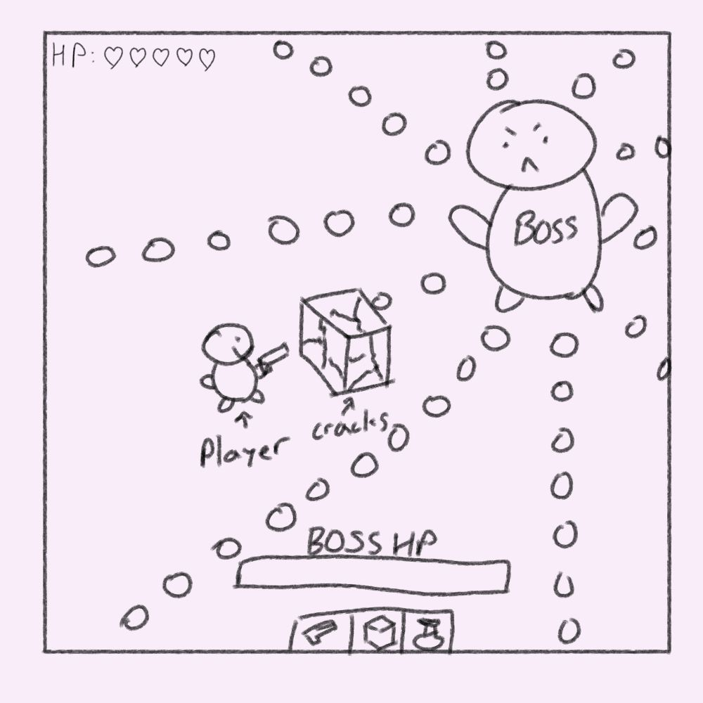
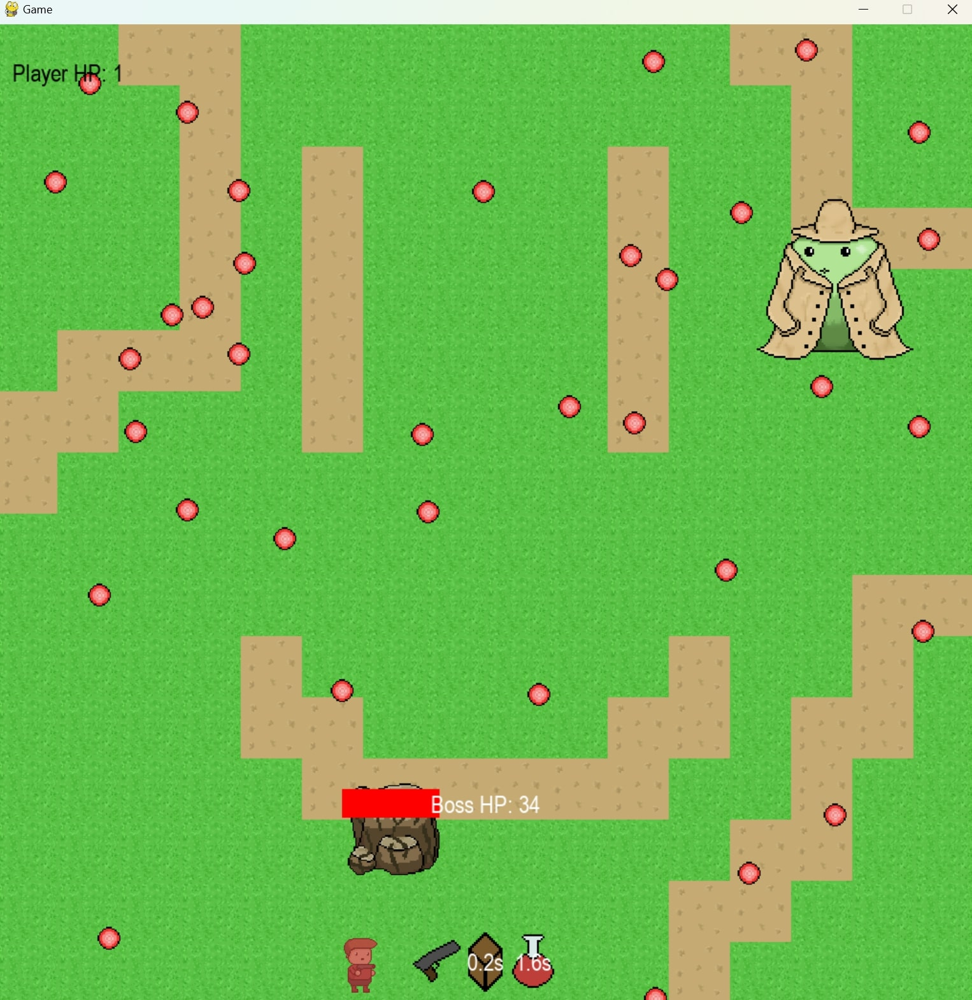

:warning: Everything between << >> needs to be replaced (remove << >> after replacing)

# << Project Title >>
## CS110 Final Project  Fall, 2024

## Team Members

Wei Yang Zhu

***

## Project Description

A game where the player fight a boss while dodging its attacks. The player can place objects to block boss projectiles and have access to potions to heal the player. 

***    

## GUI Design

### Initial Design

### Final Design

## Program Design

### Features

1. Title screen
2. Moveable Player
3. Obstacle collision / collision detection
4. Placeable object and Consumables
5. Game over screen

### Classes

- << You should have a list of each of your classes with a description >>

## ATP

| Step                 |Procedure             |Expected Results                   |
|----------------------|:--------------------:|----------------------------------:|
|  1                   | Run Counter Program  |GUI window appears with count = 0  |
|  2                   | click count button   | display changes to count = 1      |
etc...
